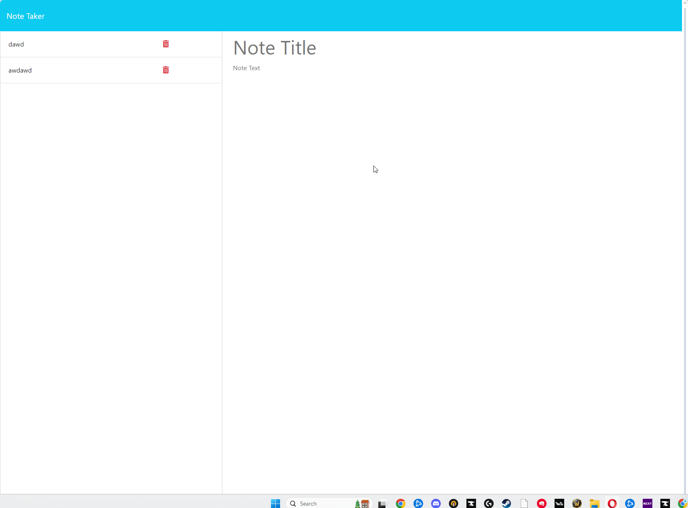

# Note Taker App

)

**Creator:** Chris Kirkley

## Overview

The Note Taker App is a simple web application that allows users to create and manage notes. It provides a user-friendly interface for adding new notes and viewing existing ones.

## Features

- Create new notes with titles and content.
- View a list of saved notes.
- Click on a note to view its details.
- Easily manage and organize your notes.

## Getting Started

To run the Note Taker App locally, follow these steps:

1. Clone this repository to your local machine:

   ```bash
   git clone https://github.com/yourusername/note-taker-app.git
2. npm install
3. node server.js (start server)
## Live Link
https://peaky00.github.io/NoteTaker/

Usage
## Create a New Note:

Click on the "Create a New Note" section.
Enter a title and note content.
Click the "Create Note" button.
View Saved Notes:

View the list of saved notes on the left side.
Click on a note to view its details on the right side.
Manage Notes:

You can create, view, and manage your notes easily using the app.
Contributing
Contributions to the Note Taker App are welcome! Feel free to fork this repository and submit pull requests to enhance its functionality or fix any issues.

## License
This project is licensed under the MIT License - see the LICENSE file for details.

## Screenshots



## Acknowledgments
This app was created by Chris Kirkley.
Happy note-taking!